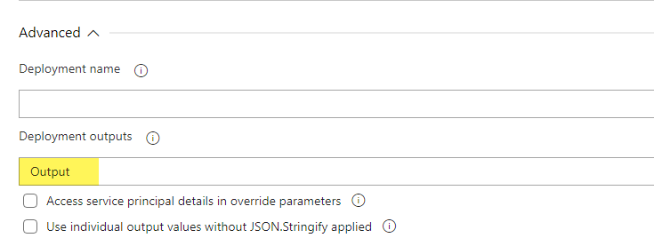

# Powershell Scripts for Deployment Pipelines

These are powershell scripts that help automate deployment tasks that are difficult or impossible to do with an ARM or Bicep template.

**Note:** The template names provided below are shortened for brevity and reference the *prefix* of the template file name only. Each Template will be named [*TemplateName*].template.bicep. Variables that are typically configured or set at the Pipeline level will be indicated as *Pipeline* for the template name.

## AddAzureUserToSqlDbRoles.ps1

This script will add an Entra user to a Sql Azure database using their ClientId. This is typically used during deployment to add the managed identity created in earlier steps of the pipeline to the Sql Server database with the appropriate roles for the tasks required.
With the exception of roleNames, paramters for this script can be provided from the output of Bicep templates used during the deployment.

### Parameters

In order for this script to run successfully, the target Sql Server must be configured for Azure AD / Entra authentication and the service principal used by the deployment pipeline must have appropriate permissions to that database to add users to roles.

| Name | Data Type | Description | Template Name | Property |
| --- | --- | --- | --- | --- | 
| identityName | string | The name of the managed identity. | managedIdentity , webapi.netfx, webapp.netfx, webapp.netcore | identityName |
| managedIdentityClientId | string | The client id for the managed identity. | managedIdentity , webapi.netfx, webapp.netfx, webapp.netcore | identityClientId |
| dbServer | string | The name of the database *server*. | sqlServer.elasticPool | sqlServerName |
| dbName | string | The name of the database  | sqlServer.elasticdb, sqlServer.elasticPool | dbName, dbNames | The name(s) of the database(s) created. The *sqlServer.elasticDb* template only creates a single database and its output variable is *dbName*. The *sqlServer.elasticPool* template can (optionally) create multiple databases; its output variable is *dbNames*.
| roleNames | string[] | An array of roles to assign to the user. This should be passed as a PowerShell array. | N/A | N/A |

### Example

This example uses several output variables from previous tasks and then adds the roles *db_datareader* and *db_datawriter* to the given database.

```bash
$(ResourcesFolder)\Powershell\AddAzureUserToSqlDbRoles.ps1 -identityName '$(identityName)' -dbServer '$(sqlServerName)' -dbName "$(databaseName)" -roleNames ("db_datareader", "db_datawriter")
```

## ReadArmOutputs.ps1

This is the script that reads the output variables from an ARM/Bicep template and injects them into the pipeline as pipeline variables. Unless the variable is 'secret', it will also log the values supplied. This script is already provided and configured in the *Run Template and Read Output* Task Group that is typically used in the deployment pipelines.

| Name | Data Type | Description |
| --- | --- | --- |
| armOutputString | string | The pipeline variable containing the output from the template.  |
| propertyPrefix | string | A prefix to use for the generated properties in addition to the name of the output variable. This can be used in cases where the outputs from 2 different templates overlap and need to be differentiated for usage. Not used with the Task Group; would only be applicable in cases where manually configured tasks are used rather than the Task Group. Default value is *none* (empty) |
| arraySeparator | string | Separator to use for output variables containing and array. Array output variables are joined and separated by this separator. Default value is semi-colon (;) |



## SetBlobStorageRBACPermissions.ps1

Sets the Role Based Access Security (RBAC) permissions for the provided identity to a specified Azure Storage account. Common scenarios to make commonly assigned roles easier to configure.

| Name | Data Type | Description | Template Name | Property |
| --- | --- | --- | --- | --- | 
| resourceGroup | string | The name of the resource group containing the storage account | N/A - Pipeline configured | ResourceGroup |
| storageAccountName | string | The name of the storage account add permissions to. | storage, funcapp.netfx | storageAccountName | 
| identityPrincipalId | string | The Entra ID for the identity. | managedIdentity , webapi.netfx, webapp.netfx, webapp.netcore | identityPrincipalId |
| setRead | boolean | Switch to set standard read permissions to Blob Storage | storage, funcapp.netfx | storageAccountName | 
| setWrite | boolean | Switch to set standard write permissions to Blob Storage | storage, funcapp.netfx | storageAccountName | 
| funcAppPerms | boolean | Switch to set standard permissions required for function apps. | storage, funcapp.netfx | storageAccountName | 
| additionalRoles | string[] | An array of strings with additional/other roles that may be required. |   |  |

### Example

```bash
-resourceGroup '$(ResourceGroup)' -storageAccountName '$(storageAccountName)' -identityPrincipalId '$(identityPrincipalId)' -setWrite $true -additionalRoles @('Storage Blob Data Contributor', 'Storage Queue Data Contributor', 'Storage Table Data Contributor')
```

## SetKeyVaultReadSecretsPermissions.ps1

Sets the permissions for a managed identity to access KeyVault appropriately.

| Name | Data Type | Description | Template Name | Property |
| --- | --- | --- | --- | --- | 
| resourceGroup | string | The name of the resource group containing the storage account | Pipeline | ResourceGroup |
| keyVaultName | string | The name of the Key Vault. | keyvault | keyVaultName | 
| identityPrincipalId | string | The Entra ID for the identity. | managedIdentity , webapi.netfx, webapp.netfx, webapp.netcore | identityPrincipalId |

### Example:

```bash
.\SetKeyVaultReadSecretsPermissions.ps1 -resourceGroup 'ACG-DTS-EnterpriseAppServices-RG' -keyVaultName 'dts-apps-dev-kv' -identityPrincipalId "842e6324-f96c-4ee2-8db6-6050db461259"
```

## SetSlotSettings.ps1

This is a script to set slot settings during deployment. Slot settings are 'sticky' with the slot and do not move when swapping slots. This script will work with Web Apps, API Apps, and Function Apps.

### Parameters

| Name | Data Type | Description | Template Name | Property |
| --- | --- | --- | --- | --- | 
| resourceGroup | string | The resource group containing the web app, web api app, or function app | Pipeline | ResourceGroup |
| webAppName | string | The name of the target app.  | webapp.netfx, webapp.netcore, webapi.netfx, funcapp.netfx | varies based on source. |
| slotName| string | The name of the slot to set values for. If omitted or blank, the production slot will be set. | Pipeline | stagingSlotName |
| appConfigEntries | string[] | Array of app config entries in the format [Name]=[Value] |    | Varies based on template and usage |

### Example

```bash
-resourceGroup '$(resourceGroup)' -webAppName '$(AppService)' -slotName '$(stagingSlotName)' -appConfigEntries @('adRedirectUri=$(adRedirectUri)')
```

